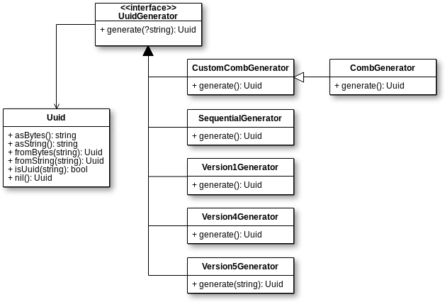

# uuid

 [](https://scrutinizer-ci.com/g/1ma/uuid/?branch=master) [](https://scrutinizer-ci.com/g/1ma/uuid/?branch=master)

A SOLID and lightweight implementation of the UUID spec for PHP +7.3



## Installation

```bash
$ composer require uma/uuid
```

## Generators

### RFC 4122 Version 1

```php
$v1 = new \UMA\Uuid\Version1Generator('01:23:45:67:89:ab');

(string) $v1->generate();
// c1f45316-dd26-11e7-b25b-0123456789ab

(string) $v1->generate();
// c1f45af4-dd26-11e7-b25b-0123456789ab

(string) $v1->generate();
// c1f45bf8-dd26-11e7-b25b-0123456789ab
```

#### How is the 'clockSeq' param chosen?

A fresh, random 14-bit value is generated every time that the 
`generate()` method is called on a Version1Generator instance.

This behaviour is compliant with the RFC spec (see section 4.1.5).

### RFC 4122 Version 4

```php
$v4 = new \UMA\Uuid\Version4Generator();

(string) $v4->generate();
// 89f18abf-4c99-488c-a7e5-4f3a58e39d44

(string) $v4->generate();
// ff02c008-3318-4464-8f7c-0fc9263830b4

(string) $v4->generate();
// d4d33558-4a48-469e-8456-a46c4c895aac
```

### RFC 4122 Version 5

```php
$ns = \UMA\Uuid\Uuid::fromString(\UMA\Uuid\Version5Generator::NS_DNS);
$v5 = new \UMA\Uuid\Version5Generator($ns);

(string) $v5->generate('foo');
// b84ed8ed-a7b1-502f-83f6-90132e68adef

(string) $v5->generate('bar');
// e8d5cf6d-de0f-5e77-9aa3-91093cdfbf62
```

### COMB Generator

This generator is not part of the RFC 4122 spec. It is a variant of
the version 4 UUID that was first described (AFAIK) by Jimmy Nilsson
in 2002 on an article named [The Cost of GUIDs as Primary Keys].

COMB UUIDs are just version 4 UUIDs whose 48 higher bits have been
overwritten with a timestamp. This guarantees to a certain extent that
the generated values are monotonic (ever increasing), which is a most desired
property when such values are used as database primary keys (or simply indexed).

```php
$comb = new \UMA\Uuid\CombGenerator();

(string) $comb->generate();
// 55fef06f-9382-4732-96b4-c13f92f7f254

(string) $comb->generate();
// 55fef06f-9392-4f41-a4c7-e036c1befcd7

(string) $comb->generate();
// 55fef06f-9396-4904-a606-c9b62c8e7aea
```

#### What is the optional $granularity argument from the constructor?

The granularity reflects the precision of the timestamp that will be
stamped onto the UUIDs, and is in fact the number of fractional digits
that will be used from a call to `microtime(true)`.

```php
var_dump(microtime(true));
// 1513212567.378735
```

This number can go from 0 (which means second-precision) to 6 (which means
microsecond-precision, the maximum that PHP is capable of and also the default value).

Since multiple COMB UUIDs generated with the same timestamp are not guaranteed to
be monotonic, the higher the granularity the stronger is that guarantee and the better
is the output of the `CombGenerator`. To bring in some perspective, my laptop
can generate over 100k COMB UUIDs in the same second, but only 1 or 2 in the same microsecond.

#### What will happen when the higher 48 bits reach `ffffffff-ffff`?

The generator will overflow and start again from `10000000-0000`. Of course, that means
that at this point the monotonic property of the generator will be lost!

#### When will the overflow occur?

It depends on the granularity that you have chosen, but the `getOverflowDate()` method returns
the exact moment it will occur.

As I write this, the nearest overflow will occur on 2059-03-13 02:56:07 UTC (for a
granularity of 5).

```php
$g6 = new \UMA\Uuid\CombGenerator(6);
$g6->getOverflowDate();
// object(DateTimeImmutable)#4 (3) {
//   ["date"]=>
//   string(26) "2112-09-17 23:53:47.000000"
//   ["timezone_type"]=>
//   int(1)
//   ["timezone"]=>
//   string(6) "+00:00"
// }

$g0 = new \UMA\Uuid\CombGenerator(0);
$g0->getOverflowDate();
// object(DateTimeImmutable)#6 (3) {
//   ["date"]=>
//   string(29) "8921556-12-07 10:44:15.000000"
//   ["timezone_type"]=>
//   int(1)
//   ["timezone"]=>
//   string(6) "+00:00"
// }
```

### Sequential Generator (UNSAFE)

The `SequentialGenerator` does not generate unique UUIDs at all. It can be used
as a replacement for real generators in testing contexts, where readable and
deterministic values might be desirable.

The first parameter of the generator will print a "pattern" on the higher 8 bytes of
its UUIDs. The second is the offset at which the counting will begin. Both are optional.

```php
$vanilla = new \UMA\Uuid\SequentialGenerator();

(string) $vanilla->generate();
// 00000000-0000-0000-0000-000000000000

(string) $vanilla->generate();
// 00000000-0000-0000-0000-000000000001

(string) $vanilla->generate();
// 00000000-0000-0000-0000-000000000002


$custom = new \UMA\Uuid\SequentialGenerator(dechex('abcd'), 255);

(string) $custom->generate();
// 00000000-0000-abcd-0000-0000000000ff

(string) $custom->generate();
// 00000000-0000-abcd-0000-000000000100

(string) $custom->generate();
// 00000000-0000-abcd-0000-000000000101
```

## The Uuid class

The `Uuid` class is modeled as a [value object] that wraps valid UUID strings. It also has
named constructors to generate Uuid objects when their intended value is known beforehand.

### Creating Uuid objects from strings

#### `Uuid::fromString(string): Uuid`

This is the preferred way to create new instances when you have
an UUID value in a string variable. The method is case insensitive.

```php
// Creates a new Uuid object from a hardcoded string
$uuid = \UMA\Uuid::fromString('96aaab69-7b76-4461-b008-cbb9cfcb6fdf');


// Passing an invalid value will result in an \InvalidArgumentException thrown
$badUuid = \UMA\Uuid::fromString('abcd');


// If you don't know beforehand if the value is a valid UUID but want
// to avoid the exception you can rely on the `Uuid::isUuid(string): bool` helper.
if (false === \UMA\Uuid::isUuid($unsafeUuid)) {
   return;
}

$safeUuid = \UMA\Uuid::fromString($unsafeUuid);
```

#### `Uuid::fromBytes(string): Uuid`

Creates a new Uuid instance from 16 raw bytes. This factory is extensively used
by the generators but it can also cover some use cases of the end user of this
library, such as when retrieving UUID strings in packed form from a database.

```php
$uuid = \UMA\Uuid::fromBytes(random_bytes(16));
```

#### `Uuid::nil(): Uuid`

Convenience helper for generating instances of the NIL UUID.

### Retrieving the inner value of an Uuid object

`Uuid` objects have two getters: `asString()` and `asBytes()`. The former returns the UUID
in its canonical textual format, the latter as a raw sequence of 16 bytes.

They can also be casted to string. This is equivalent to calling the `asString()` method.

```php
$uuid = (new \UMA\Uuid\CombGenerator)->generate();

$uuid->asBytes();
// ??????M???D????d

$uuid->asString();
// 5608bfbf-4602-4abb-9aa1-7584ab428631

(string) $uuid === $uuid->asString();
// true
```

## FAQ

### Which is the 'best' kind of UUID/Which one should I use?

UUIDs are often used as surrogate keys for tables in relational databases. This implies
that they are indexed, and index performance depends in part on how continuous
these values are. Hence, the 'best' kind of UUID is the COMB UUID.

I ran [a benchmark] on Postgres 9.6 in which I measured the time it took to insert a hundred million
pregenerated UUIDs of different kinds. Version 4 UUIDs were inserted about 32 times slower into
the table than a conventional autoincrementing integer. In contrast COMB UUIDs were "just" about 40% slower.
These results are consistent with the ones reported 15 years ago by Mr. Nilsson in his own article.

In summary, you should use COMB UUIDs unless you have specific reasons to use another kind of UUID.

### Where is Version3Generator?

Since it is exactly the same as Version 5 but relies on an
even weaker hashing algorithm I do not see the point of adding it.

### Where is Version2Generator?

As far as I know Version 2 UUIDs were never defined. The [spec](doc/SPEC.txt) does not even
mention them. Go figure.

### Why does `1ma/uuid` specifically require a 64 bit build of PHP?

Because a few sections of the `Version1Generator` and `CombGenerator` code rely on integers
being 64 bit wide (in particular, the result of casting the output of `microtime(true)` to an integer
may fill up to 56 bits at the time of writing).

If your PHP binary was built for a 32 bit architecture but don't intend to use neither of these time-based generators
you can still use this library, but will need to install it passing the `--ignore-platform-reqs` flag to composer.

### Can I write my own generators?

Yes, just implement the `UuidGenerator` interface. Here's a sample
implementation that always returns the same Uuid. This one could be useful
in a unit testing context.

```php
use UMA\Uuid\Uuid;
use UMA\Uuid\UuidGenerator;

class DeterministicGenerator implements UuidGenerator
{
    /**
     * @var Uuid
     */
    private $uuid;

    public function __construct(Uuid $uuid)
    {
        $this->uuid = $uuid;
    }

    public function generate(string $name = null): Uuid
    {
        return clone $this->uuid;
    }
}
```

### How do I run the tests?

```bash
$ composer test
```

### How do I run the benchmarks?

```bash
$ composer bench
```

As it is always the case in PHP, if the `xdebug` extension is enabled it will
have a huge impact on runtime performance that will skew the results.


[The Cost of GUIDs as Primary Keys]: http://www.informit.com/articles/article.aspx?p=25862
[a benchmark]: https://gist.github.com/1ma/c837e6f30c0869cfc1222f67ac8b1c52
[value object]: https://martinfowler.com/bliki/ValueObject.html
